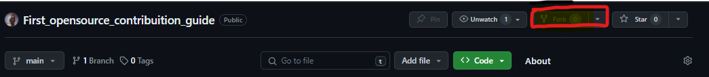
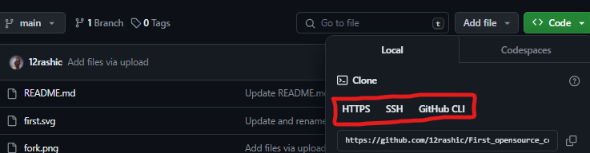
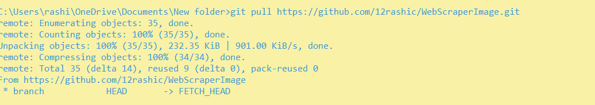
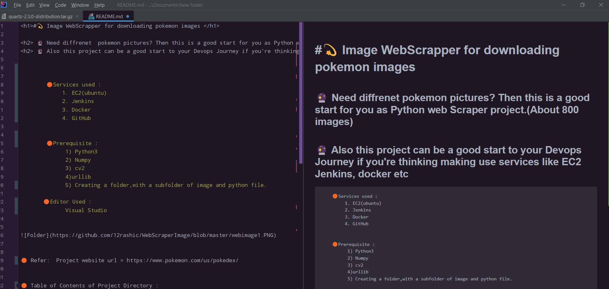
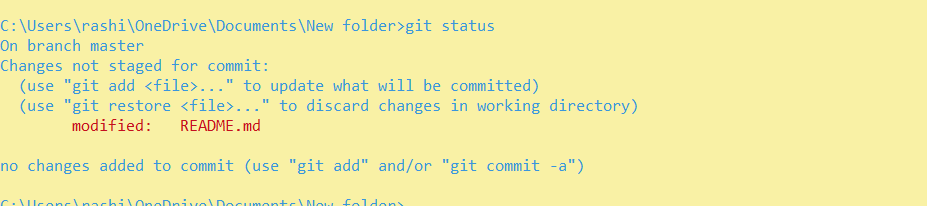
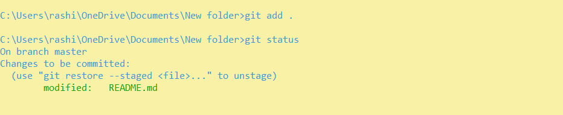
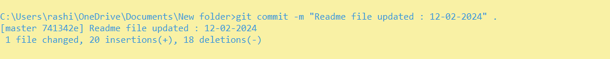
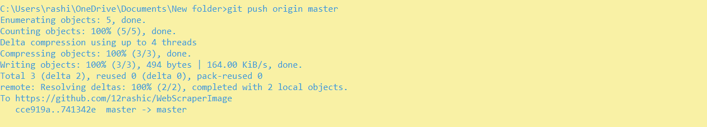

<h1> Your guide to kickstart first opensource github contribution </h1>

    

 <h3> 🙋‍♀️ What are opensource contributions </h3>
   <h3> Software application who have their code-bases available online , for others to contribute by means of improving existing software system , adding new feauture and much more </h3>
   
    

 <h3> 🙋‍♀️ What are benifits of contributing to open source projects </h3>
 
    🟡 Hands-on / practical exposure to system 
    🟡 Improved / changed perspective working with different tech-stack in integrated way 
    🟡 Learn new skills & technologies 
    🟡 Improved communication & accountability 

<h3> 🙋‍♀️ How to select first repository for contribution  </h3>

    🟢 First step is to find the technology you are good in / want to improve your skills & find repositories related to it .
    🟢 Find issues that are  having "open" , "goodfirstissue" label 

       

<h2> 🙋‍♀️ Steps for Contributing  </h2>

    🔴 Find the relevant repository & fork it 
  
     
  

       

    🔴 Clone the repository using 'ssh' / 'https' 
    

   

      

    🔴 Git pull 
    
   

      

    🔴 Open the repository in relevant folder & make required changes as per issue 

  

        

    🔴 Check the status of changes made to the repository folder :

         🔺 Git status

  

       

     🔴 Recheck the status & add the changed files :

         🔺 Git status
         🔺 Git add .
         
  

    

    🔴Git commit the changes made  :

         🔺 Git status
         🔺 Git commit -m "message" .

   

      

    🔴Git push to master branch to merge changes in main branch  :

         🔺 Git status
         🔺 Git commit -m "message" .

   

       

After all this process , you will be creating a PR (pull request) following all steps given above , when the maintainer of repository checks & will merge your PR in main branch , you'll be able to see the changes you made
in main (master) branch .

    

<h3> And vola !!  🎊
 Congratulations , yuo have made your first PR !</h3>

 <H3> If you have been able to follow the guide and it helped you , don't forget to share it , let's help building ths community 🎊
</H3>

<h3> for more such content you can follow me on </h3>

  

         

     

   
    

    
    

    
